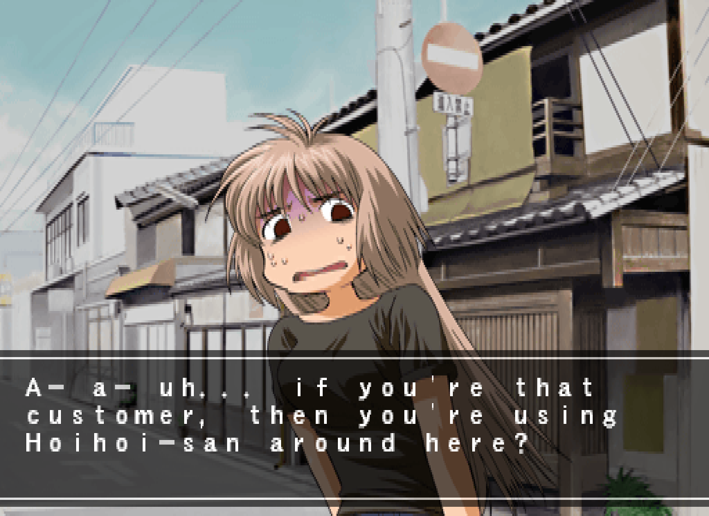

# hoihoi-en



English translation patch for the PlayStation 2 game *Ichigeki Sacchu!! Hoihoi-san* (SLPM_623.91). Byte-patches the disc image with English text, modified UI images and subtitled FMVs.

Requires a sector-by-sector .bin/.cue disc image of the game. The sha256sum of my clean disc image is: `0f1e4b15655a6249e5e56557dfef2f2c43d53b07dc5ecaf6f6b1ed9ca40fe63d`

Not tested on SLPM_623.90 (Limited Edition), SLPM_627.21 (Konami The Best), SLKA_150.15 (South Korean release), but the patcher won't work on these versions without modification since the patcher has the game executable name hard coded. I haven't got any of these versions to test with. If you can test these, please add support or let me know what the differences!

## Using the patcher

```bash
go build -o hoihoi-en .
./hoihoi-en patch clean/hoihoi.bin patched/hoihoi.bin
```
where `clean/hoihoi.bin` is a clean copy of the game, and `patched/hoihoi.bin` is the location where you want the patcher to put the patched copy.

## Requirements

- Go 1.21+
- `golang.org/x/text` (encoding package)

## Patches

FMV videos, texture assets, menus, dialogs, help tickers, tutorial, mission names/descriptions, item and weapon names, partial translation of debug menu.

ADVs are translated through the addition of a subtitle overlay (an injected MIPS machine code detour in the cutscene voice playback routine that renders text over the cutscene).

## Translation

I am not fluent in Japanese. I crossreferenced different on-device machine transcriptions (Private Transcriber Pro, Apple Speech, WhisperKit), machine translations (Google Translate, DeepL and Apple Translate) and Japanese-English and Japanese-Japanese dictionaries to complete this translation. I worry that machine translation might be a topic of debate, but it wasn't a lazy copy-paste-from-Google-Translate job. I put a lot of effort into precise translation or intentionally opinionated translation, as appropriate. If you would like to contribute a better translation or if you notice anything I've messed up, please open an issue or PR! In some cases, I was limited in available space in the binary, but if you open an issue for something or message me somewhere, I can explain my reasoning for anything.

I have favoured American English in the text of the game, even though I'm from the UK, just because I figured that would be less controversial. :P

A lot of cutscenes in the game mirror scenes from the manga, and in those cases, the Infinity Studios translation guided this translation. I chose to capitalise her name consistently as 'Hoihoi-san', since this is how it's written in Infinity Studios' English translation of the manga. It seems to match with how the ホイホイ logo (in both this and the real-world insect trap product) has the first ホ larger like a capital (though obviously this is not a feature of the language, and the insect trap is officially translated "Hoy Hoy"). The Korean cover also backs this up - it has the logo written in Korean instead of Japanese, apart from Hoihoi-san's name, which is written in Latin characters as "Hᴏɪʜᴏɪsᴀɴ". It's not like 100% proof of anything, and a lot of online product listings and game databases are definitely in favour of HoiHoi-san.

## CLI

Commands other than the `patch` command will not be useful to most users, but are just leftovers from making the patch (which may be useful/necessary for anyone who wants to contribute). `b2f` for example helped me port the crude initial hex edits I made to the .bin image at the start of the project to the more structured file offset-based structure it has now.

| Command | Arguments | Purpose |
|---------|-------|---------|
| `hoihoi-en patch` | `<input-bin> <output-bin>` | Apply all patches |
| `hoihoi-en list-files` | `<bin-path>` | List ISO 9660 directory |
| `hoihoi-en b2f` | `<bin-path> <bin-offset>` | Map raw offset -> file |
| `hoihoi-en f2b` | `<bin-path> <file-path> <file-offset>` | Map file offset -> raw |
| `hoihoi-en dump-missions` | `<bin-path>` | Print mission text |
| `hoihoi-en dump-items` | `<bin-path>` | Print item text |
| `hoihoi-en list-ufp` | `<bin-path> <ufp-disc-path>` | List UFP archive entries |
| `hoihoi-en extract-pss` | `<bin-path> <disc-path> <out-pss>` | Extract FMV from disc |
| `hoihoi-en make-pss-xor` | `<bin-path> <edited-pss> <manifest-json>` | Create FMV XOR delta |
| `hoihoi-en recover-pss` | `<bin-path> <manifest-json> <disc-path> <out-pss>` | Recover edited FMV from XOR |
| `hoihoi-en extract-psi` | `<bin-path> <ufp-disc-path> <ufp-entry-path> <out-png>` | Extract texture -> PNG |
| `hoihoi-en extract-psi-all` | `<bin-path> <ufp-disc-path> <out-dir>` | Extract all textures |
| `hoihoi-en make-psi-xor` | `<bin-path> <edited-png> <manifest-json>` | Create texture XOR delta |
| `hoihoi-en recover-psi` | `<bin-path> <manifest-json> <ufp-entry-path> <out-png>` | Recover edited texture from XOR |

## Package layout

| Package | Purpose |
|---------|---------|
| `encoding` | Shift-JIS <-> Go string, fullwidth conversion |
| `disc` | MODE2/2352 CD sector layout, ISO 9660 directory traversal |
| `ufp` | UFP (UFV1) archive format - chunk parser, file entry lookup |
| `bsv` | BSV table format - string pool bookkeeping, SRTS/EMAN/DNIK/ATAD |
| `psi` | PSI (3ISP) texture format - palette swizzling, indexed PNG round-trip |
| `mips` | MIPS IV instruction encoders, CodeBuf builder, sprite field offsets |
| `cave` | Code cave region allocation model |
| `asset` | XOR delta manifests, SHA-256 checksum verification |
| `game` | Named constants for disc paths, BSV table bases, and field indices |

The root package connects these: reading from the disc image, ordering the 17 patch groups, writing the output.

## Verification

```bash
go test ./...                       # Unit tests (sub-packages)
./scripts/verify-reference.sh       # Byte-for-byte comparison (good for checking if patcher changes are mistakenly affecting the binary)
```